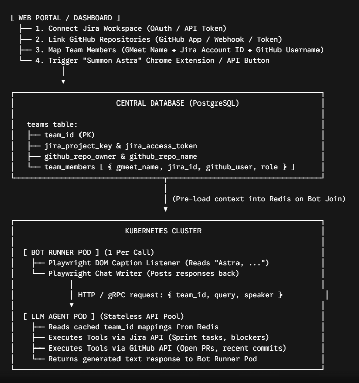
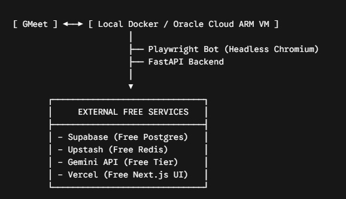
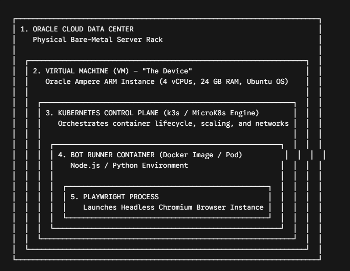
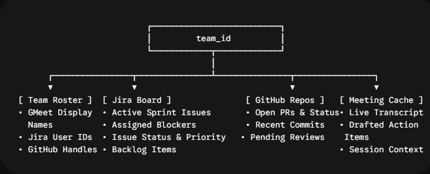
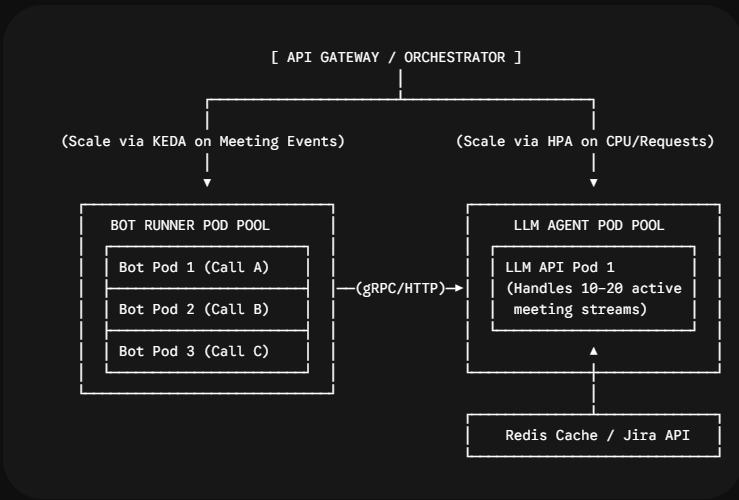
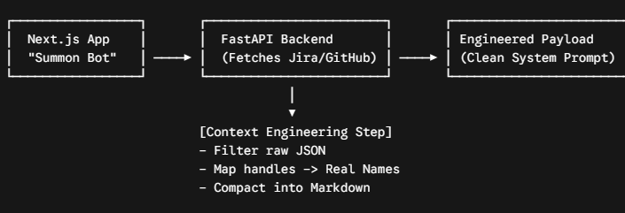
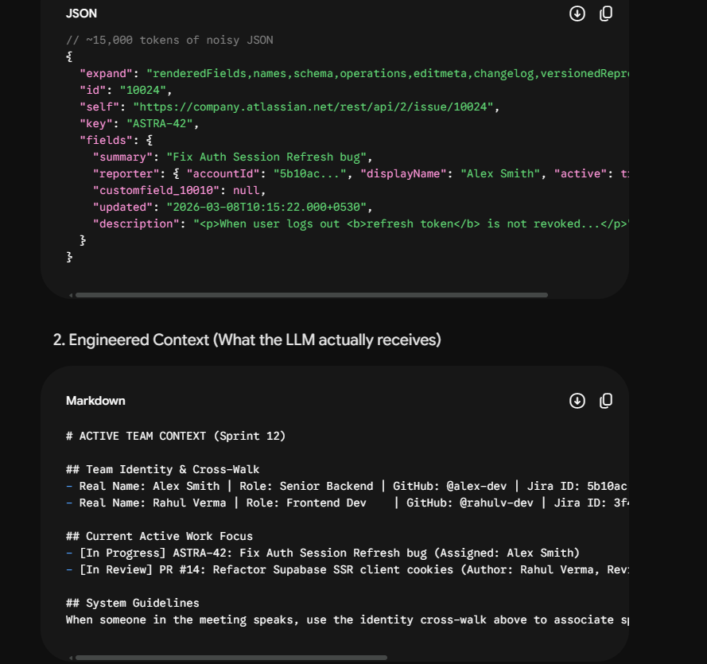
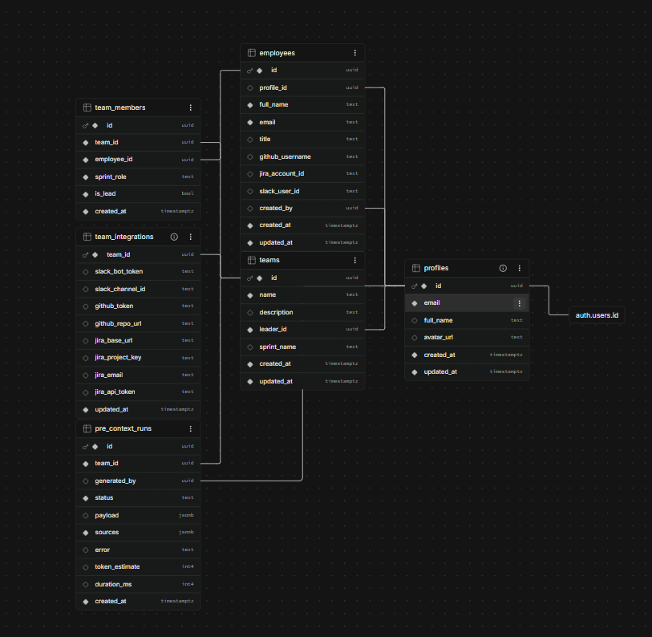

1) we have the constraint to know CONTEXT engineering , what to send to the LLM cause of the context constraint 
2) we need to know how we are gonna manage the on spot rectifications
    1) maybe we can chumma use the STANDUP mode to payattention cause astra gets activated to reply back if we call it right !!! soo we can actively make it reply all the time that sounds EXPENSIVE 

3) Alright to the BOT POD we are sending the CONTEXT direcrtly !! alright 
4) before sending to the bot direcrly ,we must doo some CONTEXT enginerring cause too much NOISE and DATA will be pushed to the CONTAINER at once and may cause overload if for LARGER Projects !!!

-- THE CONVERSION should resemble this

-- Load balancer for Gemini API. cause 1k cant have the same API 

---
The existing DB ARCH :
