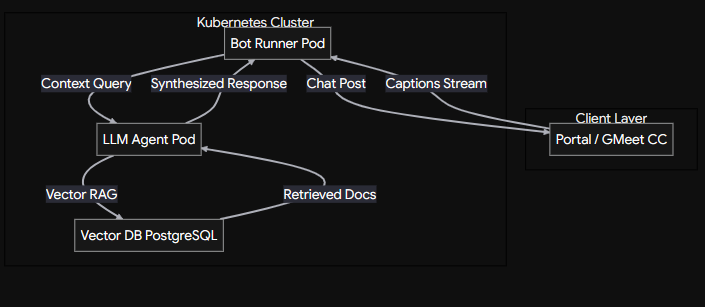
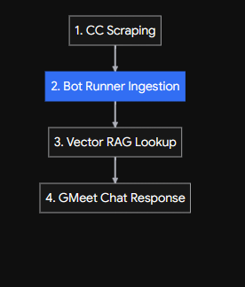

# Kubernetes Horizontal Pod Autoscaling (HPA) Setup Guide

This guide details the complete, step-by-step recreation of the auto-scaling Kubernetes environment, including cluster setup, manifest definitions, networking bridges, and an asynchronous Python load generator.

---

## 1. Prerequisites & Dependencies

Ensure the following tools are installed on your Windows host:

* **Docker Desktop** (Running with WSL2 backend enabled)
* **Minikube** (`minikube`)
* **Kubernetes CLI** (`kubectl`)
* **Python 3.8+**

---

## 2. Cluster Initialization

Start Minikube using the Docker driver and enable the `metrics-server` addon (required for HPA to query pod CPU/memory utilization).

```powershell
# Start Minikube cluster
minikube start --driver=docker

# Enable Metrics Server for HPA monitoring
minikube addons enable metrics-server

# Verify metrics-server deployment status
kubectl get pods -n kube-system -l k8s-app=metrics-server

```

---

## 3. Kubernetes Manifest Definitions

Create three YAML files inside your project directory (`C:\Users\sigin\OneDrive\Desktop\Capstone_2027\K8n`).

### `deployment.yaml`

Defines the `http-echo` container workload with low CPU request limits (`100m`) so that load testing triggers autoscaling rapidly.

```yaml
apiVersion: apps/v1
kind: Deployment
metadata:
  name: url-shortener
  labels:
    app: url-shortener
spec:
  replicas: 2
  selector:
    matchLabels:
      app: url-shortener
  template:
    metadata:
      labels:
        app: url-shortener
    spec:
      containers:
      - name: http-echo
        image: hashicorp/http-echo:latest
        args:
          - "-text=Redirecting..."
          - "-listen=:5678"
        ports:
        - containerPort: 5678
        resources:
          requests:
            cpu: "100m"
            memory: "64Mi"
          limits:
            cpu: "200m"
            memory: "128Mi"

```

### `service.yaml`

Exposes the pods internally via a `NodePort` service mapping port `5678`.

```yaml
apiVersion: v1
kind: Service
metadata:
  name: url-shortener-service
spec:
  type: NodePort
  selector:
    app: url-shortener
  ports:
    - protocol: TCP
      port: 5678
      targetPort: 5678

```

### `hpa.yaml`

Configures the Horizontal Pod Autoscaler to maintain an average CPU utilization of **50%**. Scales between 2 and 10 replicas.

```yaml
apiVersion: autoscaling/v2
kind: HorizontalPodAutoscaler
metadata:
  name: url-shortener-api
spec:
  scaleTargetRef:
    apiVersion: apps/v1
    kind: Deployment
    name: url-shortener
  minReplicas: 2
  maxReplicas: 10
  metrics:
  - type: Resource
    resource:
      name: cpu
      target:
        type: Utilization
        averageUtilization: 50

```

---

## 4. Applying Manifests

Deploy all resource manifests to the cluster:

```powershell
kubectl apply -f deployment.yaml
kubectl apply -f service.yaml
kubectl apply -f hpa.yaml

```

Verify that resources are running:

```powershell
kubectl get deployments
kubectl get services
kubectl get hpa

```

---

## 5. Port-Forwarding Bridge

Because Docker on Windows operates in an isolated VM network, establish a static port-forwarding channel from `localhost:8080` to the internal service port `5678`.

Run this command in a dedicated background terminal (**Terminal 4**) and leave it open:

```powershell
kubectl port-forward service/url-shortener-service 8080:5678

```

---

## 6. Async Load Generator Script (`tester.py`)

Create `tester.py` to generate concurrent non-blocking HTTP requests using standard Python libraries.

```python
import asyncio
import time

HOST = "127.0.0.1"
PORT = 8080
CONCURRENT_WORKERS = 100  # Simultaneous coroutines

# HTTP/1.1 GET payload
HTTP_PAYLOAD = (
    f"GET / HTTP/1.1\r\n"
    f"Host: {HOST}:{PORT}\r\n"
    f"User-Agent: AsyncLoadTester/1.0\r\n"
    f"Connection: close\r\n\r\n"
).encode("utf-8")

total_requests = 0
start_time = time.time()

async def worker():
    global total_requests
    while True:
        try:
            reader, writer = await asyncio.open_connection(HOST, PORT)
            writer.write(HTTP_PAYLOAD)
            await writer.drain()
            
            await reader.read(256)
            
            writer.close()
            await writer.wait_closed()
            total_requests += 1
        except Exception:
            await asyncio.sleep(0.01)

async def monitor():
    while True:
        await asyncio.sleep(1)
        elapsed = time.time() - start_time
        rps = total_requests / elapsed if elapsed > 0 else 0
        print(f"\r🚀 Total Sent: {total_requests} | Throughput: {rps:.1f} req/sec | Active Coroutines: {CONCURRENT_WORKERS}", end="")

async def main():
    print(f"🔥 Starting Non-Blocking Async Stress Test on http://{HOST}:{PORT}")
    print(f"⚡ Concurrent Coroutines: {CONCURRENT_WORKERS}\n")
    
    tasks = [asyncio.create_task(worker()) for _ in range(CONCURRENT_WORKERS)]
    tasks.append(asyncio.create_task(monitor()))
    await asyncio.gather(*tasks)

if __name__ == "__main__":
    try:
        asyncio.run(main())
    except KeyboardInterrupt:
        print("\n\n🛑 Async load test terminated.")

```

---

## 7. Multi-Terminal Execution Layout

To run and observe the complete environment, launch 4 side-by-side PowerShell terminals:

| Terminal | Command | Purpose |
| --- | --- | --- |
| **Terminal 1** | `kubectl get pods -l app=url-shortener -w` | Watch real-time pod creation/termination |
| **Terminal 2** | `kubectl get hpa url-shortener-api -w` | Watch CPU percentage spikes and target replica changes |
| **Terminal 3** | `python .\tester.py` | Run non-blocking HTTP stress test |
| **Terminal 4** | `kubectl port-forward service/url-shortener-service 8080:5678` | Keep active network bridge alive |


------

------
