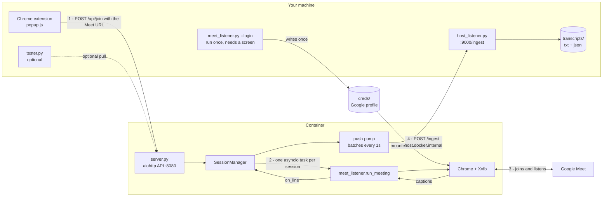
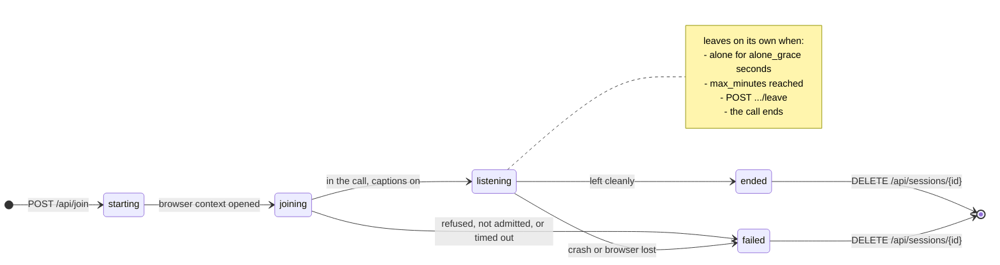

# Meet Notetaker — containerised architecture

Four pieces, one job: you click a button in Chrome, a bot joins that meeting
inside a container, and you read the transcript from anywhere.

| Piece | File | Runs | Role |
|---|---|---|---|
| **Extension** | `extension/` | Chrome | Sends the current Meet URL to the container. |
| **Server** | `server.py` | Container | Receives the URL, owns the browser, **pushes transcripts out**. |
| **Bot** | `meet_listener.py` | Container | Joins, mutes, turns on captions, scrapes. Still a standalone CLI too. |
| **Host listener** | `host_listener.py` | **Your machine** | Receives pushed transcripts, prints and saves them. |
| **Client** | `tester.py` | Anywhere | Command-line client for the API (pull, when you want it). |

**The flow you asked for:** extension → container → bot joins the URL →
transcript is **pushed back to your host**. Nothing polls. `tester.py` and the
popup can still pull the same data, but they are optional conveniences now.

**Credentials never live in the image.** You log in once on a machine with a
screen; the resulting profile directory is mounted into the container.

---

## 1. How the parts talk



## 2. A session, end to end

```mermaid
sequenceDiagram
    autonumber
    actor You
    participant EXT as Extension popup
    participant API as server.py in container
    participant BOT as run_meeting
    participant GM as Google Meet
    participant SINK as host_listener.py on your host

    Note over You,SINK: one-time: meet_listener.py --login writes creds/, mounted at /creds
    Note over SINK: you start this first, it waits for pushes

    You->>EXT: click "Send this meeting to the bot"
    EXT->>EXT: read active tab URL, validate it is a Meet link
    EXT->>API: POST /api/join {url, name} + X-API-Key
    alt already at MEET_MAX_SESSIONS
        API-->>EXT: 409 busy
    end
    API-->>EXT: 201 {session_id}
    API->>BOT: asyncio task, browser context from /creds
    API->>SINK: POST /ingest {event: session_started}

    BOT->>GM: join, mute, enable captions
    loop while in the call
        GM-->>BOT: caption DOM mutates
        BOT->>API: on_line(record)
        API->>API: queue it
    end

    loop every MEET_CALLBACK_BATCH_SECONDS
        API->>SINK: POST /ingest {event: lines, lines: [...]}
        SINK->>SINK: print + append transcripts/{id}.txt and .jsonl
        Note right of API: 3 retries with backoff;<br/>a dead listener never<br/>stalls transcription
    end

    alt you click "Make the bot leave"
        EXT->>API: POST /api/sessions/{id}/leave
    else everyone else leaves the meeting
        BOT->>BOT: alone for alone_grace seconds
        BOT->>GM: hang up
    end
    BOT-->>API: exit code
    API->>SINK: POST /ingest {event: session_ended, state, error}
```

## 3. Session states



---

## 3b. The push contract

The container POSTs to `MEET_CALLBACK_URL` with `X-API-Key: MEET_CALLBACK_KEY`.
Three event types, same envelope:

```json
{
  "event": "lines",
  "session_id": "a1b2c3d4e5f6",
  "url": "https://meet.google.com/abc-defg-hij",
  "name": "",
  "state": "listening",
  "seq_start": 12,
  "line_count": 15,
  "error": null,
  "sent_at": "2026-08-23T09:14:02+00:00",
  "lines": [
    {"ts": "...", "speaker": "Alice Chen", "text": "on Friday",
     "continuation": true, "line": "[09:14:02] Alice Chen: ...on Friday"}
  ]
}
```

| Event | When | Carries |
|---|---|---|
| `session_started` | the bot task begins | url, name — no lines |
| `lines` | every `MEET_CALLBACK_BATCH_SECONDS` while text arrives | the new lines, `seq_start` is their offset |
| `session_ended` | the bot stops for any reason | final `state`, `error`, `line_count` |

**Delivery:** 3 attempts with backoff per batch. Failures are counted
(`push_failures`) but never block the bot. If the listener stays down, the queue
grows to 5000 lines and then drops the oldest, counted as `dropped` — the bot
keeps transcribing regardless. Both counters show up in `GET /api/sessions/{id}`,
so a silent host listener is visible rather than mysterious.

Since the host may miss lines while it is down, the container still keeps its
own copy in `/data/transcripts/{id}.jsonl` and still answers `?since=N` pulls.
Push is the delivery mechanism; the API remains the source of truth.

## 4. Setup

### Step 0 — start the host listener (on your machine, first)

```bash
python host_listener.py --port 9000 --key "$MEET_CALLBACK_KEY"
```

It prints the exact `MEET_CALLBACK_URL` to hand the container, then waits.
Transcripts land in `./transcripts/` as both `.txt` and `.jsonl`.

### Step 1 — log in once (needs a screen)

```bash
python meet_listener.py --login --profile ./creds
```

Sign in in the window that opens. Confirm it prints `Signed in.` — an exit code
of `4` means the profile is still anonymous.

### Step 2 — start the container

```bash
export MEET_API_KEY=$(python -c "import secrets;print(secrets.token_urlsafe(24))")
docker compose up --build -d
python tester.py health --key "$MEET_API_KEY"
```

`health` is the gate: it reports `credentials: present` only when Step 1
actually took. Anything else means bots will join as anonymous guests.

### Step 3 — load the extension

`chrome://extensions` → enable **Developer mode** → **Load unpacked** →
select the `extension/` folder. Open its options and set the server URL and the
API key.

### Step 4 — use it

Open a Meet call, click the extension, press **Send this meeting to the bot**.
Admit the bot when it knocks. The transcript streams into the popup.

Or from the terminal:

```bash
python tester.py join https://meet.google.com/abc-defg-hij --watch
```

---

## 5. API reference

Every `/api/*` route except `/api/health` needs `X-API-Key` when `MEET_API_KEY`
is set. **Leaving it unset means anyone who can reach the port can send your
logged-in bot into any meeting.**

| Method | Path | Notes |
|---|---|---|
| `GET` | `/api/health` | Liveness, and whether credentials are actually mounted. |
| `POST` | `/api/join` | `{url, name, guest?, max_minutes?, alone_grace?}` → `201`, or `409` when busy. |
| `GET` | `/api/sessions` | Every session and its state. |
| `GET` | `/api/sessions/{id}` | One session. |
| `GET` | `/api/sessions/{id}/transcript?since=N` | Lines from `N`. Feed `next` back as `since` to poll. |
| `POST` | `/api/sessions/{id}/leave` | Hang up now. |
| `DELETE` | `/api/sessions/{id}` | Forget a finished session (`409` while running). |

### Transcript records

```json
{
  "ts": "2026-08-22T17:02:20+00:00",
  "speaker": "Alice Chen",
  "text": "on Friday",
  "continuation": true,
  "line": "[17:02:20] Alice Chen: ...on Friday"
}
```

`text` is always clean. `continuation: true` means this line **extends the
previous line from the same speaker** — Meet grows a caption in place, so a long
sentence arrives in pieces. Join them for prose, or render the `...` marker as
`tester.py` and the popup do. `line` is the console-ready form.

---

## 6. Configuration

| Variable | Default | Meaning |
|---|---|---|
| `MEET_API_KEY` | *(empty)* | Required `X-API-Key`. Empty disables auth. |
| `MEET_PROFILE_DIR` | `/creds` | Mounted Google profile. |
| `MEET_DATA_DIR` | `/data` | Where transcripts are written. |
| `MEET_MAX_SESSIONS` | `1` | Concurrent meetings. Above 1, each session gets a profile copy. |
| `MEET_HEADLESS` | `0` | Keep at `0` — Meet blocks headless. Xvfb supplies the display. |
| `MEET_CORS_ORIGIN` | `*` | Tighten to the extension's origin if you like. |
| `MEET_REQUIRE_LOGIN` | `1` | Join as the mounted account only; refuse anonymous joins. |
| `MEET_ALLOW_ANY_URL` | `0` | **Testing only.** Lets `/api/join` open non-Meet URLs. |
| `MEET_CALLBACK_URL` | `http://host.docker.internal:9000/ingest` | Where transcripts are pushed. Empty disables push. |
| `MEET_CALLBACK_KEY` | *(empty)* | Sent as `X-API-Key` to the host listener. |
| `MEET_CALLBACK_BATCH_SECONDS` | `1.0` | How often batches are flushed to the host. |

### Picking the keys

`MEET_API_KEY` and `MEET_CALLBACK_KEY` are **not** issued by Google or any other
service — there is nothing to sign up for. They are shared secrets you invent,
and every collaborator invents their own. Generate two *different* strings:

```bash
python -c "import secrets;print(secrets.token_urlsafe(32))"   # MEET_API_KEY
python -c "import secrets;print(secrets.token_urlsafe(32))"   # MEET_CALLBACK_KEY
```

Put them in `.env` (copy `.env.example` first). `.env` is gitignored — never
commit a real value and never paste one into this file:

```
MEET_API_KEY=<first string>
MEET_CALLBACK_KEY=<second string>
```

The same value has to appear everywhere it is checked:

| Key | Who needs the same value |
|---|---|
| `MEET_API_KEY` | `.env` (the container), the extension's options page, `tester.py --key` |
| `MEET_CALLBACK_KEY` | `.env` (the container), `host_listener.py --key <value>` |

A mismatch looks like a `401` from any `/api/*` route, or like the container
logging a failed push while `host_listener.py` never writes a file. Rotating is
just picking new strings and restarting both sides — see `SECURITY.md`.

**Scaling:** one session per container is the reliable default — Chrome locks
its user-data directory, so concurrency inside one container requires copying
the profile per session. Prefer more replicas over a higher `MEET_MAX_SESSIONS`.

---

## 7. Tests

```bash
python tests/test_captions.py   # CC click, scraping, full run_meeting, empty-meeting exit
python tests/test_server.py     # server process + tester.py client, end to end
python tests/test_push.py       # container -> host push: server.py + host_listener.py
```

Both run against a synthetic Meet page in a real browser — no meeting required.
`test_server.py` starts the actual server as a subprocess and drives it exactly
as the extension does, including auth rejection and the `409` busy path.
`test_push.py` runs `host_listener.py` and `server.py` as two separate
processes and asserts the transcript reaches the host **without anyone polling**,
including the callback auth check and the files written on the host side.

---

## 8. Security notes

- The mounted profile is a **live Google session**. Treat `creds/` like a
  password: it is not in the image, not in git, and should not be world-readable.
- Always set `MEET_API_KEY` if the port is reachable by anyone else.
- Set `MEET_CALLBACK_KEY` too: without it, anything that can reach the host
  listener's port can inject fake transcript lines into your files.
- Never set `MEET_ALLOW_ANY_URL` outside tests — it turns `/api/join` into an
  open "fetch any URL in a logged-in browser" service.
- Transcribing a meeting is subject to the consent rules of everyone in it.
  The bot shows up in the participant list, but announce it anyway.
